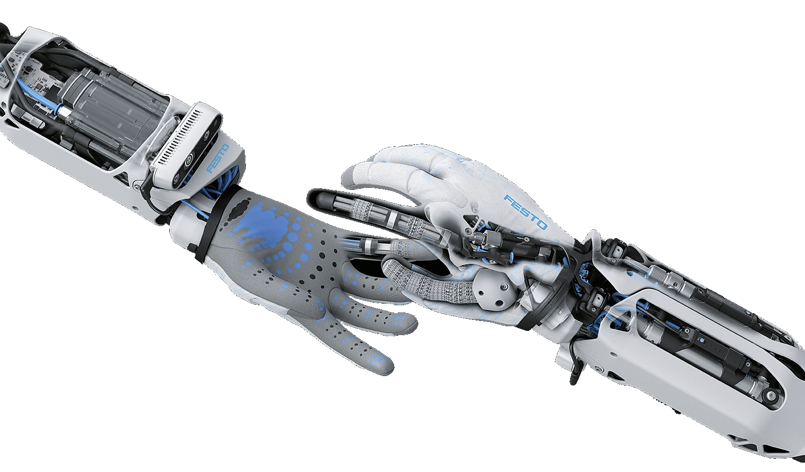

[](https://www.festo.com/group/de/cms/10156.htm)

> <p style="font-size:30px">BionicSoftHand Python Libraries </p>
<br></br>

# SHORTCUTS
* Install Instructions
    * [Manual Installation](#MANUAL-INSTALL)
    * [Automatic Installation](#AUTOMATIC-INSTALL)
* BionicSoftHand Setup
    * [Mount the hand](#mount-the-hand)
    * [First connection](#first-connection)
    * [Debug LEDs](#Debug-leds)
    * [Control the hand](#Control-the-hand)
<br></br>

# LICENSE
The Festo BionicSoftHand python libraries are published under the [GNU GPL v3.0 License](https://www.gnu.org/licenses/gpl-3.0.de.html).

# PURPOSE
These libraries implement the necessary messages and core functionalities to communicate with the BionicSoftHand

# DOCUMENTATION
Under the folder docs is the complete [documentation](docs/build/html/index.html) for the code.

# IMPORTANT
The maximum supply pressure for the BionicSoftHand is **5 bars**. If you connect more than this amount of air pressure the hand gets damaged and is not usable anymore.

# INSTALL INSTRUCTIONS
## HELPER SCRIPTS
There are some helper scripts [here](https://github.com/Schwimo/linux_config) to setup your environment.

## MANUAL INSTALL
* Download or clone the necessary repositories
    * [PID Control](https://github.com/Schwimo/bionic-pid-control)
    * [DHCP](https://github.com/Schwimo/bionic-dhcp)
    * [Bionic Message Tools](https://github.com/Schwimo/bionic-message-tools)
    * [BionicSoftHand Python Libraries](https://github.com/Schwimo/phand-python-libs)
* And install one by one on your computer. To do this change into the root directory of each cloned repository and enter the following command. This executes the `setup.py` file and installes the libraries locally on your computer. The point in the end means to use the current directory.
    * `` pip3 install .  ``

## AUTOMATIC INSTALL
The automatic install is only available for the BionicSoftHand **with ROS**

**Linux**:
```bash
bash <(wget -qO- https://raw.githubusercontent.com/Schwimo/linux_config/master/scripts/setup_phand.bash)
```
<br>

# BIONIC SOFT HAND 2.0 SETUP
[](https://www.festo.com/group/de/cms/10156.htm)
The BionicSoftHand is a pneumatic gripper with 12 independent controllable chambers.

## MOUNT THE HAND
### POWER SUPPLY
The BionicSoftHand needs a 24V power supply. Alternatively you can connect a 48V power source. Refer to your support team for more information.
### AIR SUPPLY
There are two tube connectors on the bottom side of the hand. Next to it are small letters engraved.
Connect the exhaust tube to the `E` and the supply tube to the `B`. Not more than 5 bars!
### ETHERNET CONNECTION
Connect the ethernet cable with your local network.
If you have no DHCP activated the default IP address of the hand will be `192.168.4.34` make sure that you are in the same subnet.

## FIRST CONNECTION
If you want to try out the connection between your computer and the BionicSoftHand, execute the python script `test_phand_connection.py ` under the "scripts" folder.

This script prints out if the connection was successful or notes any problems.

## DEBUG LEDS
There are three LEDs on the mainboard of the BionicSoftHand. 
One is glowing blue as soon as the power supply is activated.   
The other two are used as debug indication and are located next to each other. 
LED 1 `(outer)` LED 2 `(inner)`


**STARTUP ROUTINE** if everything is connected correctly

1. LED 1: Red on
2. LED 1: Red off
3. LED 1: Green on
4. LED 1: Green off

**LED 2**: Indicates the connection state of the BionicSoftHand     
 * Blinking Green: Not connected       
 * Blinking Blue: Connected        
 * Nothing or not blinking: Problem        

**LED 1**: Indicates an error of the BionicSoftHand     
 * Blue on: Not able to send data      
 * Red on: Can't set the valves        
 * Green on: Problem reading out the sensors       

 ## Control the Hand

The phand.py script provides several functions to communicate with the BionicSoftHand. For example if you want to move the fingers, use the function "set_pressure_data" and pass an array with 12 float values between 100000.0 (1Bar or 100000 PSI) and 600000.0. Each index of the array corresponds to a different actor. The mapping is in the table below.

* **Valve control:** There are 24 valves inside the hand, 12 supply valves and 12 exhaust valves. 
The mapping for each supply or exhaust valve is shown in the table below. The first index is always the supply valve and the second one in the brackets is used for the exhaust valve.
* **Pressure control:** If the pressure control mode is active (default), send 12 pressure values to the hand where the index below is mapped to each actor.
* **Position control:** Not implemented yet

| Index | Corresponding actor | Description |
| ----- | ------------------- | ----------- |
0 (12)  | Thumb side          | Rotate the thumb left / right  
1 (13)  | Thumb lower         | Open / close the lower part of the thumb
2 (14)  | Counter pressure    | The counter pressure is used for the wrist cylinders, the index side and the thumb rotation as restoring spring
3 (15)  | Thumb upper         | Open / close the upper part of the thumb
4 (16)  | Index finger upper  | Open / close the upper part of the index finger
5 (17)  | Wrist left          | Move the left wrist cylinder up / down
6 (18)  | Index finger lower  | Open / close the lower part of the index finger
7 (19)  | Wrist right         | Move the right wrist cylinder up / down
8 (20)  | Middle finger       | Open / close the middle finger
9 (21)  | Index side          | Move the index finger left / right
10 (22) | Ring finger         | Open / close the ring finger
11 (23) | Pinky               | Open / close the pinky